# Vehicle Detection Project

---

**Vehicle Detection Project**

The goals / steps of this project are the following:

* Perform a Histogram of Oriented Gradients (HOG) feature extraction on a labeled training set of images and train a classifier Linear SVM classifier
* Optionally, you can also apply a color transform and append binned color features, as well as histograms of color, to your HOG feature vector.
* We train a classifier of which the input is the normalized features and output is vehicle / nonvehicle label.
* We implement a sliding-window technique and use the trained classifier to search for vehicles in images.
* Run the pipeline on a video stream (start with the test_video.mp4 and later implement on full project_video.mp4) and create a heat map of recurring detections frame by frame to reject outliers and follow detected vehicles.
* Estimate a bounding box for vehicles detected.

[//]: # (Image References)
[image1]: ./output/HOG_feature_example.png
[image2]: ./output/window_grid.png
[image3a0]: ./output_images/test_image_detection/classification_0.png
[image3a1]: ./output_images/test_image_detection/classification_1.png
[image3a2]: ./output_images/test_image_detection/classification_2.png
[image3a3]: ./output_images/test_image_detection/classification_3.png
[image3a4]: ./output_images/test_image_detection/classification_4.png
[image3a5]: ./output_images/test_image_detection/classification_5.png
[image3b0]: ./output_images/test_image_detection/classification_after_nim_0.png
[image3b1]: ./output_images/test_image_detection/classification_after_nim_1.png
[image3b2]: ./output_images/test_image_detection/classification_after_nim_2.png
[image3b3]: ./output_images/test_image_detection/classification_after_nim_3.png
[image3b4]: ./output_images/test_image_detection/classification_after_nim_4.png
[image3b5]: ./output_images/test_image_detection/classification_after_nim_5.png
[image3fp2n0]: ./output_images/negative_image/fp_2_0000.png
[image3fp2n1]: ./output_images/negative_image/fp_2_0001.png
[image3fp2n2]: ./output_images/negative_image/fp_2_0002.png
[image4a]: ./output_images/test_video_output/joint_heatmap_tv_0_36.png
[image4b]: ./output_images/test_video_output/bbox_tv_0_36.png 

### [Rubric](https://review.udacity.com/#!/rubrics/513/view) Points

Below I will consider the rubric points individually and describe how I addressed each point in my implementation.  

---
## Writeup / README and Organization of Files

The writeup (this document) addresses the rubric points. In addition to the write-up, the submission includes:

* Vehicle_Detection.ipynb: Implementation of the main pipeline, including feature extraction, training, hard negative image mining, executing pipeline on test images, test video and project video.

* Feature_Optimization.ipynb: Experiments to optimize of parameters for the feature extraction step.

* A support libraries of functions (supporting_functions.py) used in the project. Some of these functions are borrowed from the course with or without modification.

* Output from test images
* Output from test video
* Output from Project video

---
## Histogram of Oriented Gradients (HOG)

### 1. Explain how (and identify where in your code) you extracted HOG features from the training images.

The execution of this step is contained the code cell [4] in the "Vehicle_Detection.ipynb notebook" where the code calls the function "extract_features". This function is in line 80-107 in "supporting_functions.py". It is a wrapper that calls individual feature extractions routines: get_hog_features, bin_spatial, color_hist, defined in line 41-78 in "supporting_functions.py".

To extract HOG feature, I first convert the image (vehicle / non-vehicle) into a color space of choice. Then for each selected channel in the color space, we calculate the corresponding HOG feature vector. The final feature is a concatenation of all HOG feature vectors. 

The feature optimization is described in a separate notebook "HOG_Feature_And_Optimization.ipynb". After the optimization, I choose the following features:
- Color Space: 'LUV'
- Channel for calculating HOG features: L(0), U(1)
- Number of Orientations: 16
- Number of Pixels per Cell: (8, 8)
- Number of Cells per Block: (2,2)
- Add Binned Color Feature: No
- Add Color Histogram Feature: Yes

An example of extracted HOG feature is given below:
![alt text][image1]

### 2. Explain how you settled on your final choice of HOG parameters.

I conducted 3 set of experiments to optimize the HOG parameters. 
* Experiment 1: Selection of _color space_ and _HOG channels_. [Code cell 4 of "Feature_Optimization.ipynb"]
* Experiment 2: Selection of _number of pixels per cell_, _number of orientations_, _number of cells per block_. [Code cell 5 of "Feature_Optimization.ipynb"]
* Experiment 3: Test whether to add two other feature vectors: binned colors and color histograms. [Code cell 6 of "Feature_Optimization.ipynb"]

In each experiment, I use the Linear SVM Classifier. I split the data into 5 folds for cross validation. The training and test accuracies from the cross validation are reported. 

#### Experiment 1: color space and HOG channels

The table below is the comparison of the performance for different color space and HOG channels sorted by test accuracy. The test accuracy and its standard deviation is calculated from 5 fold cross validation. 

We observe that the top two color spaces are 'LUV' and 'YCrCb'. In addition, under both 'LUV' and 'YCrCb', the performance with using channel 0 and 1, i.e., LU for LUV and YCb for YCrCb is similar to that of using all 3 channels and almost achives the best performance. Therefore, in the following experiment, we will only examine two combinations of color space and HOG channels: **(LUV, [0,1])** and **(YCrCb, [0,1])**.

Note that in this experiment, both binned colors and color histogram features are enabled, and the rest of parameter are chosen as : _number of pixels per cell_ is 8, _number of orientations_ is 8, _number of cell per block_ is 2. 

###### Table 1: Comparison of color spaces and HOG channels

| color space, HOG channel|   test_accuracy |   test_std |   train_accuracy |   train_std |
|:-----------------------|----------------:|-----------:|-----------------:|------------:|
| ('LUV', '[0, 1]')      |          0.9928 |     0.0015 |           1.0000 |      0.0000 |
| ('YCrCb', '[0, 1, 2]') |          0.9925 |     0.0013 |           1.0000 |      0.0000 |
| ('LUV', '[0, 1, 2]')   |          0.9925 |     0.0011 |           1.0000 |      0.0000 |
| ('YCrCb', '[0, 1]')    |          0.9922 |     0.0017 |           1.0000 |      0.0000 |
| ('HSV', '[0, 2]')      |          0.9920 |     0.0002 |           1.0000 |      0.0000 |
| ('HSV', '[0, 1, 2]')   |          0.9900 |     0.0007 |           1.0000 |      0.0000 |
| ('YCrCb', '[0, 2]')    |          0.9885 |     0.0021 |           1.0000 |      0.0000 |
| ('LUV', '[0, 2]')      |          0.9882 |     0.0012 |           1.0000 |      0.0000 |
| ('HSV', '[1, 2]')      |          0.9881 |     0.0012 |           1.0000 |      0.0000 |
| ('HSV', '[2]')         |          0.9844 |     0.0025 |           1.0000 |      0.0000 |
| ('LUV', '[0]')         |          0.9811 |     0.0033 |           1.0000 |      0.0000 |
| ('YCrCb', '[0]')       |          0.9803 |     0.0031 |           1.0000 |      0.0000 |
| ('HSV', '[0, 1]')      |          0.9797 |     0.0017 |           1.0000 |      0.0000 |
| ('RGB', '[0, 1]')      |          0.9784 |     0.0041 |           1.0000 |      0.0000 |
| ('RGB', '[0, 1, 2]')   |          0.9783 |     0.0038 |           1.0000 |      0.0000 |
| ('RGB', '[1]')         |          0.9766 |     0.0015 |           1.0000 |      0.0000 |
| ('RGB', '[1, 2]')      |          0.9766 |     0.0036 |           1.0000 |      0.0000 |
| ('LUV', '[1, 2]')      |          0.9762 |     0.0017 |           1.0000 |      0.0000 |
| ('RGB', '[0, 2]')      |          0.9761 |     0.0041 |           1.0000 |      0.0000 |
| ('LUV', '[1]')         |          0.9758 |     0.0008 |           1.0000 |      0.0000 |
| ('RGB', '[2]')         |          0.9737 |     0.0040 |           1.0000 |      0.0000 |
| ('HSV', '[0]')         |          0.9723 |     0.0019 |           1.0000 |      0.0000 |
| ('HSV', '[1]')         |          0.9721 |     0.0026 |           1.0000 |      0.0000 |
| ('YCrCb', '[1, 2]')    |          0.9716 |     0.0023 |           1.0000 |      0.0000 |
| ('RGB', '[0]')         |          0.9715 |     0.0028 |           1.0000 |      0.0000 |
| ('YCrCb', '[1]')       |          0.9700 |     0.0019 |           1.0000 |      0.0000 |
| ('YCrCb', '[2]')       |          0.9643 |     0.0019 |           1.0000 |      0.0000 |
| ('LUV', '[2]')         |          0.9636 |     0.0012 |           1.0000 |      0.0000 |

#### Experiment 2: pixels per cell, orientations, cells per block

For either of color space and HOG channel combinations, we vary the number of pxiels per cell among {4, 8, 16}, the number of orientations among {4, 8, 16} and the number of cells per block among {1, 2 ,3}. 

We made the following observations:
- The best choice of number of orientations is 16: It achieves better accuracy than that of 4 or 8 orientations regardless of other setting. 
- The choice of cells per block does not significantly change the accuracy. We determine this parameter based two other factors: First, considering the actual application, since we would like the method to be less sensitive to shadows, it is preferable to take a normalization. Thus we exclude the case where number of cells per block is 1. Second, given the limited number of training data, we would like to keep a small number of features. Since the number of features increases signficiantly when the number of cells per block increases from 2 to 3, we choose 2 as the number of cells per block. 
- The choice of pixels per cell also does not seem to have a signifcant impact on the accuracy clear from the experiment. We consider two other issues: First, using 4 leads to signifcantly larger number of features and is not preferable due to the limited traing set size. Second, the number of pixels per cell is also the minimum step size of the moving windows for the car search, because we use a precomputed HOG feature grid. We would like to keep the step size small to reduce the probability of missed detection. Considering the above two issues, we decide to use 8 as the number of pixels per cell. 

###### Table 2: Comparison of HOG parameters

| Parameters                            |   feature_size |   test_accuracy |   test_std |   train_accuracy |   train_std |   Orientations |   Pixels Per Cell |   Cells Per Block |
|:-------------------------------|---------------:|----------------:|-----------:|-----------------:|------------:|---------------:|------------------:|------------------:|
| ('YCrCb', '[0, 1]', 8, 16, 2)  |           7088 |          0.9944 |     0.0007 |           1.0000 |      0.0000 |             16 |                 8 |                 2 |
| ('LUV', '[0, 1]', 4, 16, 2)    |          29616 |          0.9943 |     0.0008 |           1.0000 |      0.0000 |             16 |                 4 |                 2 |
| ('LUV', '[0, 1]', 4, 16, 1)    |           9008 |          0.9942 |     0.0008 |           1.0000 |      0.0000 |             16 |                 4 |                 1 |
| ('LUV', '[0, 1]', 16, 16, 2)   |           1968 |          0.9940 |     0.0007 |           1.0000 |      0.0000 |             16 |                16 |                 2 |
| ('LUV', '[0, 1]', 8, 16, 2)    |           7088 |          0.9939 |     0.0011 |           1.0000 |      0.0000 |             16 |                 8 |                 2 |
| ('LUV', '[0, 1]', 16, 16, 3)   |           1968 |          0.9939 |     0.0008 |           1.0000 |      0.0000 |             16 |                16 |                 3 |
| ('LUV', '[0, 1]', 8, 16, 1)    |           2864 |          0.9938 |     0.0007 |           1.0000 |      0.0000 |             16 |                 8 |                 1 |
| ('LUV', '[0, 1]', 8, 16, 3)    |          11184 |          0.9937 |     0.0013 |           1.0000 |      0.0000 |             16 |                 8 |                 3 |
| ('YCrCb', '[0, 1]', 8, 16, 1)  |           2864 |          0.9935 |     0.0015 |           1.0000 |      0.0000 |             16 |                 8 |                 1 |
| ('YCrCb', '[0, 1]', 8, 16, 3)  |          11184 |          0.9934 |     0.0011 |           1.0000 |      0.0000 |             16 |                 8 |                 3 |
| ('LUV', '[0, 1]', 4, 16, 3)    |          57264 |          0.9932 |     0.0017 |           1.0000 |      0.0000 |             16 |                 4 |                 3 |
| ('LUV', '[0, 1]', 16, 16, 1)   |           1328 |          0.9930 |     0.0007 |           1.0000 |      0.0000 |             16 |                16 |                 1 |
| ('LUV', '[0, 1]', 4, 8, 1)     |           4912 |          0.9930 |     0.0008 |           1.0000 |      0.0000 |              8 |                 4 |                 1 |
| ('YCrCb', '[0, 1]', 4, 16, 2)  |          29616 |          0.9930 |     0.0013 |           1.0000 |      0.0000 |             16 |                 4 |                 2 |
| ('LUV', '[0, 1]', 8, 8, 2)     |           3952 |          0.9928 |     0.0015 |           1.0000 |      0.0000 |              8 |                 8 |                 2 |
| ('YCrCb', '[0, 1]', 16, 16, 2) |           1968 |          0.9927 |     0.0010 |           1.0000 |      0.0000 |             16 |                16 |                 2 |
| ('LUV', '[0, 1]', 8, 8, 1)     |           1840 |          0.9926 |     0.0017 |           1.0000 |      0.0000 |              8 |                 8 |                 1 |
| ('YCrCb', '[0, 1]', 4, 16, 1)  |           9008 |          0.9926 |     0.0015 |           1.0000 |      0.0000 |             16 |                 4 |                 1 |
| ('LUV', '[0, 1]', 8, 8, 3)     |           6000 |          0.9923 |     0.0018 |           1.0000 |      0.0000 |              8 |                 8 |                 3 |
| ('YCrCb', '[0, 1]', 8, 8, 2)   |           3952 |          0.9922 |     0.0017 |           1.0000 |      0.0000 |              8 |                 8 |                 2 |
| ('YCrCb', '[0, 1]', 4, 8, 1)   |           4912 |          0.9922 |     0.0020 |           1.0000 |      0.0000 |              8 |                 4 |                 1 |
| ('LUV', '[0, 1]', 4, 8, 2)     |          15216 |          0.9921 |     0.0016 |           1.0000 |      0.0000 |              8 |                 4 |                 2 |
| ('YCrCb', '[0, 1]', 4, 16, 3)  |          57264 |          0.9920 |     0.0016 |           1.0000 |      0.0000 |             16 |                 4 |                 3 |
| ('YCrCb', '[0, 1]', 16, 16, 1) |           1328 |          0.9918 |     0.0002 |           1.0000 |      0.0000 |             16 |                16 |                 1 |
| ('LUV', '[0, 1]', 16, 8, 2)    |           1392 |          0.9918 |     0.0015 |           1.0000 |      0.0000 |              8 |                16 |                 2 |
| ('YCrCb', '[0, 1]', 16, 16, 3) |           1968 |          0.9918 |     0.0011 |           1.0000 |      0.0000 |             16 |                16 |                 3 |
| ('YCrCb', '[0, 1]', 8, 8, 3)   |           6000 |          0.9916 |     0.0024 |           1.0000 |      0.0000 |              8 |                 8 |                 3 |
| ('LUV', '[0, 1]', 4, 8, 3)     |          29040 |          0.9915 |     0.0020 |           1.0000 |      0.0000 |              8 |                 4 |                 3 |
| ('LUV', '[0, 1]', 16, 8, 3)    |           1392 |          0.9913 |     0.0016 |           1.0000 |      0.0000 |              8 |                16 |                 3 |
| ('YCrCb', '[0, 1]', 4, 8, 2)   |          15216 |          0.9910 |     0.0013 |           1.0000 |      0.0000 |              8 |                 4 |                 2 |
| ('YCrCb', '[0, 1]', 4, 8, 3)   |          29040 |          0.9906 |     0.0012 |           1.0000 |      0.0000 |              8 |                 4 |                 3 |
| ('YCrCb', '[0, 1]', 8, 8, 1)   |           1840 |          0.9904 |     0.0012 |           1.0000 |      0.0000 |              8 |                 8 |                 1 |
| ('LUV', '[0, 1]', 16, 8, 1)    |           1072 |          0.9899 |     0.0016 |           1.0000 |      0.0000 |              8 |                16 |                 1 |
| ('YCrCb', '[0, 1]', 16, 8, 2)  |           1392 |          0.9898 |     0.0015 |           1.0000 |      0.0000 |              8 |                16 |                 2 |
| ('YCrCb', '[0, 1]', 16, 8, 3)  |           1392 |          0.9886 |     0.0012 |           1.0000 |      0.0000 |              8 |                16 |                 3 |
| ('YCrCb', '[0, 1]', 16, 8, 1)  |           1072 |          0.9876 |     0.0016 |           1.0000 |      0.0000 |              8 |                16 |                 1 |
| ('LUV', '[0, 1]', 8, 4, 3)     |           3408 |          0.9839 |     0.0012 |           1.0000 |      0.0000 |              4 |                 8 |                 3 |
| ('YCrCb', '[0, 1]', 8, 4, 3)   |           3408 |          0.9834 |     0.0028 |           1.0000 |      0.0000 |              4 |                 8 |                 3 |
| ('YCrCb', '[0, 1]', 8, 4, 2)   |           2384 |          0.9831 |     0.0028 |           1.0000 |      0.0000 |              4 |                 8 |                 2 |
| ('LUV', '[0, 1]', 8, 4, 2)     |           2384 |          0.9830 |     0.0009 |           1.0000 |      0.0000 |              4 |                 8 |                 2 |
| ('LUV', '[0, 1]', 4, 4, 2)     |           8016 |          0.9820 |     0.0026 |           1.0000 |      0.0000 |              4 |                 4 |                 2 |
| ('LUV', '[0, 1]', 4, 4, 3)     |          14928 |          0.9816 |     0.0021 |           1.0000 |      0.0000 |              4 |                 4 |                 3 |
| ('LUV', '[0, 1]', 4, 4, 1)     |           2864 |          0.9802 |     0.0011 |           1.0000 |      0.0000 |              4 |                 4 |                 1 |
| ('YCrCb', '[0, 1]', 4, 4, 2)   |           8016 |          0.9801 |     0.0012 |           1.0000 |      0.0000 |              4 |                 4 |                 2 |
| ('YCrCb', '[0, 1]', 4, 4, 1)   |           2864 |          0.9799 |     0.0028 |           1.0000 |      0.0000 |              4 |                 4 |                 1 |
| ('YCrCb', '[0, 1]', 4, 4, 3)   |          14928 |          0.9794 |     0.0008 |           1.0000 |      0.0000 |              4 |                 4 |                 3 |
| ('LUV', '[0, 1]', 8, 4, 1)     |           1328 |          0.9788 |     0.0013 |           1.0000 |      0.0001 |              4 |                 8 |                 1 |
| ('LUV', '[0, 1]', 16, 4, 2)    |           1104 |          0.9778 |     0.0021 |           0.9999 |      0.0001 |              4 |                16 |                 2 |
| ('YCrCb', '[0, 1]', 8, 4, 1)   |           1328 |          0.9773 |     0.0019 |           1.0000 |      0.0000 |              4 |                 8 |                 1 |
| ('YCrCb', '[0, 1]', 16, 4, 2)  |           1104 |          0.9761 |     0.0027 |           0.9999 |      0.0001 |              4 |                16 |                 2 |
| ('LUV', '[0, 1]', 16, 4, 3)    |           1104 |          0.9744 |     0.0031 |           1.0000 |      0.0000 |              4 |                16 |                 3 |
| ('YCrCb', '[0, 1]', 16, 4, 3)  |           1104 |          0.9742 |     0.0022 |           0.9998 |      0.0001 |              4 |                16 |                 3 |
| ('LUV', '[0, 1]', 16, 4, 1)    |            944 |          0.9737 |     0.0015 |           0.9998 |      0.0002 |              4 |                16 |                 1 |
| ('YCrCb', '[0, 1]', 16, 4, 1)  |            944 |          0.9711 |     0.0008 |           0.9999 |      0.0001 |              4 |                16 |                 1 |

#### Experiment 3: binned colors and color histogram
We experiment with adding or not adding binned colors, as well as with adding or not adding color histogram. For each of the 4 combinations of choices, we use HOG features with the following parameter: Color space is LUV or YCrCb, HOG channel is [0,1] (LU or YCr), number of orientations is 16, 16 pixels per cell, 2 cells per block.

The result is summarised in the table below. We observe that adding either feature increases the accuracy significantly while there is minimal improvement from using both features. Since feature size for color histogram is much smaller than that of the binned colors, we only add color histogram feature to the HOG feature. 

###### Table 3: Comparison 
| Color Space, Hog Channel   | Binned Color   | Color Histogram   |   test_accuracy |   test_std |   feature_size |
|:---------------------------|:---------------|:------------------|----------------:|-----------:|---------------:|
| ('LUV', '[0, 1]')          | False          | False             |          0.9876 |     0.0025 |           6272 |
| ('LUV', '[0, 1]')          | True           | False             |          0.9934 |     0.0011 |           7040 |
| ('LUV', '[0, 1]')          | False          | True              |          0.9923 |     0.0020 |           6320 |
| ('LUV', '[0, 1]')          | True           | True              |          0.9939 |     0.0011 |           7088 |
| ('YCrCb', '[0, 1]')        | False          | False             |          0.9893 |     0.0015 |           6272 |
| ('YCrCb', '[0, 1]')        | True           | False             |          0.9938 |     0.0007 |           7040 |
| ('YCrCb', '[0, 1]')        | False          | True              |          0.9929 |     0.0018 |           6320 |
| ('YCrCb', '[0, 1]')        | True           | True              |          0.9944 |     0.0007 |           7088 |

### 3. Describe how (and identify where in your code) you trained a classifier using your selected HOG features (and color features if you used them).
I train a linear SVM classifier using the following steps:
1. Flatten and concatenate the HOG features and color histogram feature into a feature vector.
2. Normalize each element of the feature vector to have zero mean and unit standard deviation across the traing data set.
3. Train a linear SVM classifier on the normalized features. 

The noramlization and linear SVM steps are combined into a pipeline, and executed in code cell 6 and 7 in "Vehicle_Detection.ipynb".

I experimented with the penality parameter C for linear SVM but did not observe an significant difference.

---
## Sliding Window Search

### 1. Describe how (and identify where in your code) you implemented a sliding window search.  How did you decide what scales to search and how much to overlap windows?

I implemented a sliding window search with 4 group of windows, each of a different size. The processing is done in the "search_cars" function in line 200 - 294 of "supporting_functions.py". For each window, I extract the features abd apply the previously trained scaler and classifier. 

in which the function calculate the features for each window. 

The set of sliding windows is specified in Code Cell [9] in "Vehicle_Detection.ipynb". The windows, overlayed on top of one of the test image, are shown below:

![alt text][image2]

The window sizes are: 64, 96, 128, 192. The following are considered by deciding on the sliding window design:
* I use image sizes that have multiples of 32 to reduce the impact of resize operation.
* I consider the fact that the vehicles far away are smalelr and those close by are larger. Therefore, I use the group of windows of size 64 near the center of the images and restrict where it is applied to a rectangle area of 780 wide and 128 height. 
Similarly, the group of window of size 96 is aplied larger rectangle. The grouup of wndows size 192 occupies the largest area.
* I restrict the search window to approximately buttom half of the image to reduce false positives since the road is covered by only the bottom half.
* Based on the reasoning that each group is designed to cover a specific region with a corresponding set of car sizes, I use the same overlap ratio across the groups so that the number of windows (in the same group) that cover one car is approximatley the same. 
* I use an overlap of 7/8 of the window size for each window group. I want to maximize the overlap in order to minimize the probability of missed detection due to partial overlap betwen a window and the vehicle of interest. The current choice is the largest overlap allowed for window size 64x64 due to the restriction posed by precomputed HOG feature grid. 

### 2. Show some examples of test images to demonstrate how your pipeline is working.  What did you do to optimize the performance of your classifier?

To optimize the performance of the classifier, in addition to the feature optimization described above, I also applied a **hard negative mining** step to obtain the final classifier for the video processing. Note that I set the class_weight to "balanced" in order to avoid the issue of unbalanced training set when augmenting the training set with images from hard negative mining. 

1. Training the classifier (verion 1) from the entire set images from GIT, KITTI_extracted, and "Extras"
2. Applying the first version of the classifier to the set of 6 test images. Label each of the detected windows as either true postivie or false positive. Extract the portion of images inside those false positive windows into separate new images. (Code Cell [12] in "Vehicle_Detection.ipynb")
3. Augment the original data set with the set of false positive images, and retrain the classifier. (Code Cell [13-15] in "Vehicle_Detection.ipynb")
The classifier obtained from step 3 is the final classifier. 

The outcome of final classifier applied to two of the test images are depicted below:

![alt text][image3b2]

![alt text][image3b4]

The blue and red boxes are the detected windows where blue is a true positive and red is a false positive. The gray box is a manually draw box to mark the ground truth position of the vechile. 

#### Hard Negative Mining

For the set of test images, I manually draw a box for each vehicle (Code cell [11] in "Vehicle_Detection.ipynb"). After applying the first classifier, I label each detected window as false positive or true postive based on whether it overlaps with the manually drawn boxes for vehicles. For each window marked as false positive, I extra the region in the window, resize it to 64 x 64 and save as an nagative image. All the negative image are then used to augment the set of non-vehicle iamges. 

For example, in the image below, the red boxes are the false positives and blue boxes are the true positives. 
![alt text][image3a2]

The set of false positive images extracted from this test image are displayed below

| false positive image | false positive image | false positive image |
|:-------------------|:-------------------|:-------------------|
| ![][image3fp2n0]  | ![][image3fp2n1]  | ![][image3fp2n2]  |

| Before Hard Negative Mining  | After Hard Negative Mining  |
|:-----------------------------|:----------------------------|
| ![][image3a0]                | ![][image3b0]               |
| ![][image3a1]                | ![][image3b1]               |
| ![][image3a2]                | ![][image3b2]               |
| ![][image3a3]                | ![][image3b3]               |
| ![][image3a4]                | ![][image3b4]               |
| ![][image3a5]                | ![][image3b5]               |

We observe that the hard negative mining successfully eliminates most of the false positives from the first classifier.

## Video Implementation

### 1. Link to the final video output.  

Here's a [link to my test video result](./output_videos/test_video_marked.mp4)

Here's a [link to my project video result](./output_videos/project_video_marked.mp4)

### 2. Filter for false positives and methods for combining overlapping bounding boxes.

To compute the final box for each vehicle, I apply the following steps:

1. For each frame, I record the detected windows.
2. For each frame, I create a per-frame heatmap $H$ counting how many windows cover each pixel.
3. I then update the _accumulative-heatmap_ $H_{accumulative}$ with the new frame using the following formula
$$H_{accumulative} = \alpha f(H) + (1-\alpha) H_{accmulative}$$ 
where $f$ is a nonlinear function to downweight high value heat map pixels. In our report, $f$ is chosen to be $f(x)=\sqrt{x}$.
4. I then threshold the accumulative heatmap with a threshold.
5. Finally, I use scipy.ndimage.measurement.label to identify individual blobs in the thresholded accumulative heatmap. I then construct the bounding boxes to cover each blob.

These methods are implemented as in the _HotWindowHistory_ object in code cell [17] of "Vehicle_Detection.ipynb". Step 2-3 are implemented in update_hot_window method. Step 4 and 5 are impelmented in get_bbox method. The overall pipeline is implemented in code cell [18].

#### Reducing false positives by a low-pass filter, anda 
To reduce the false positives, I apply two techniques in step 3:
1. Low-pass filter
2. Non-linear function $f$ to downweight per-frame high value heat map pixels to reduce the effect of a single frame with a larger number of detected windows, in order to reduce false positives induced by such a frame. 

Below is an example of the pipeline applied to the test video with the following parameters: $\alpha=0.05$, threshold = 1. 

| Image with Detected Windows(Step 1)  | Per Frame Heatmap(Step 2)           | Accumulative Heapmap (Step 3)| Combined Blobs and boxes|
|:-----------------------------|:----------------------------|:----------------------------|:----------------------------|
|     | 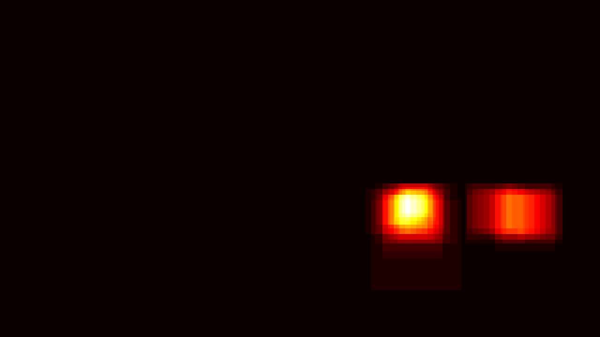  |       |   |
|     | 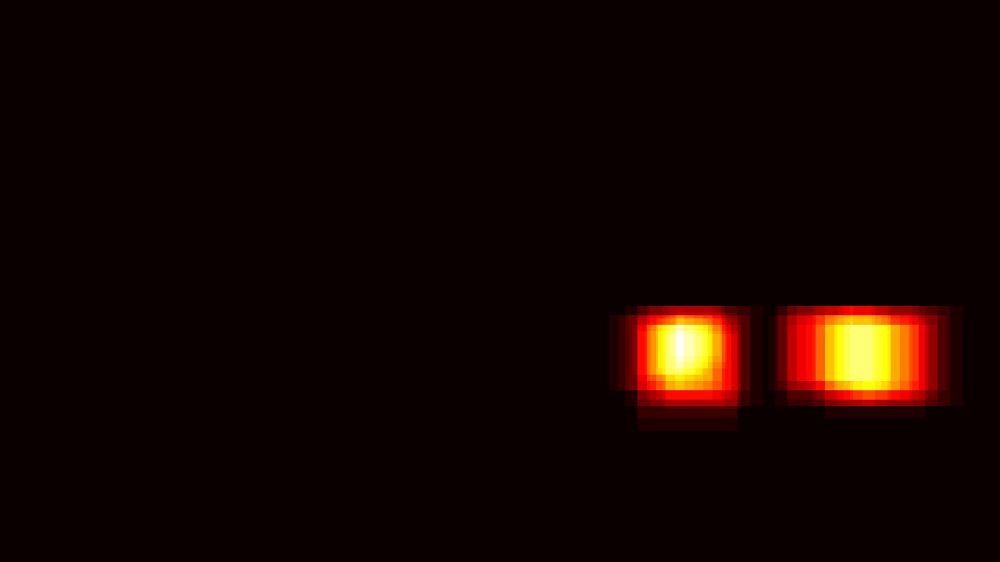  |   |   |
|     |   |   |   |
| 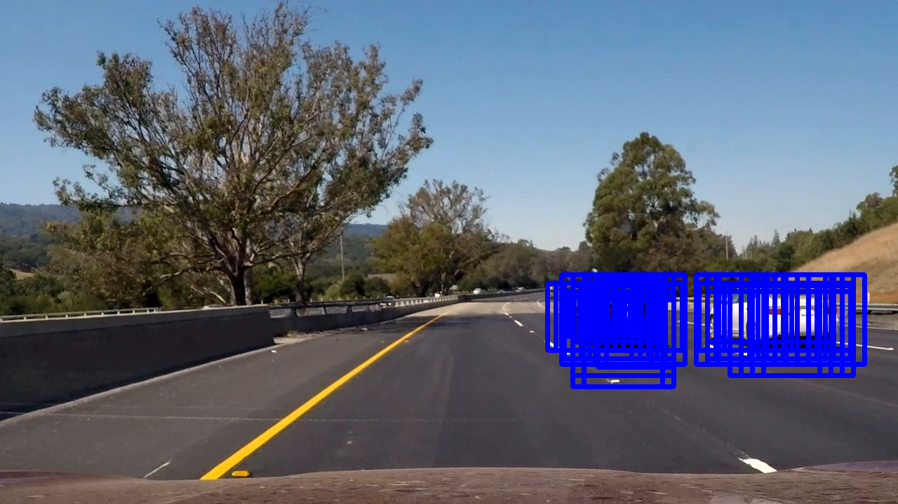    |   | 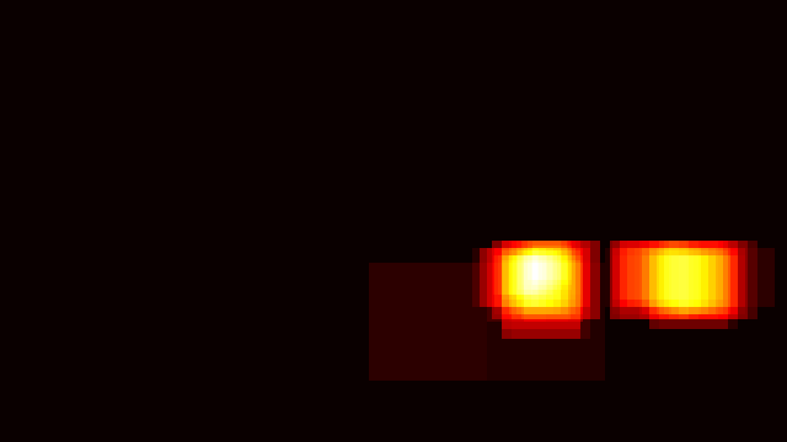  |   |
|     |   |   | 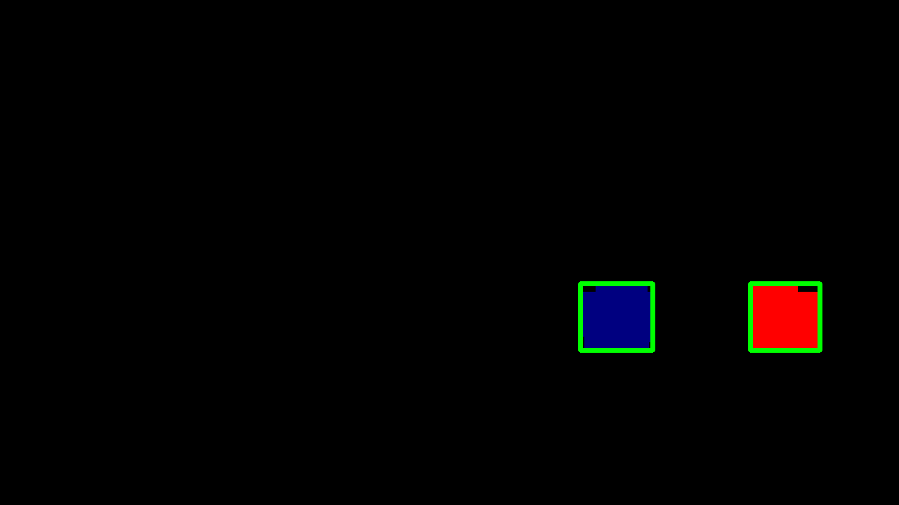  |
| 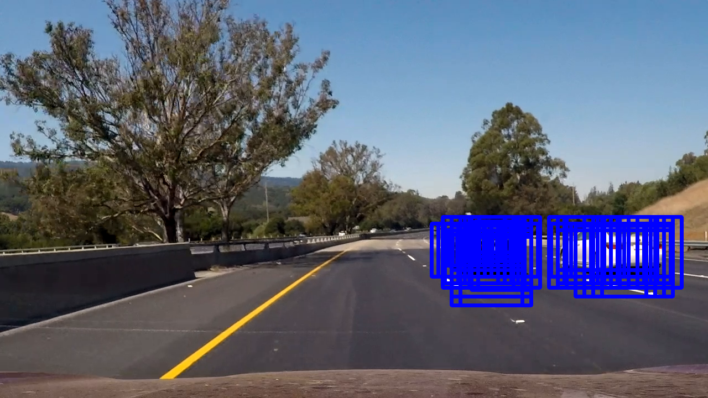    | 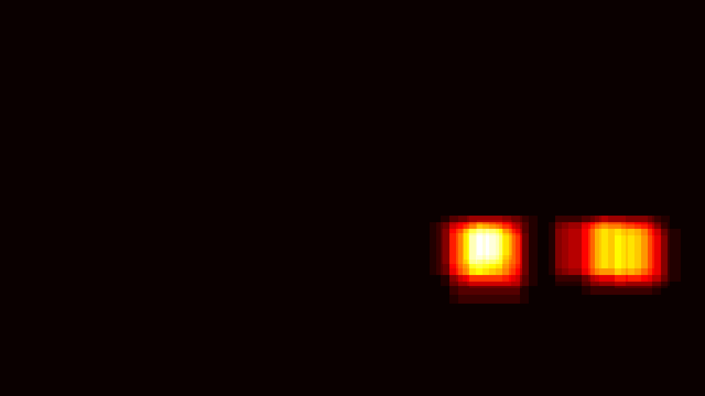  |   |   |
| 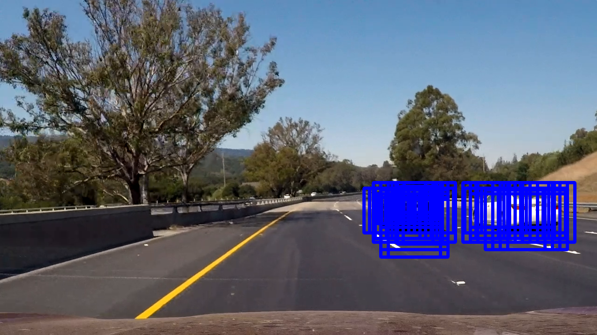    |   |   | 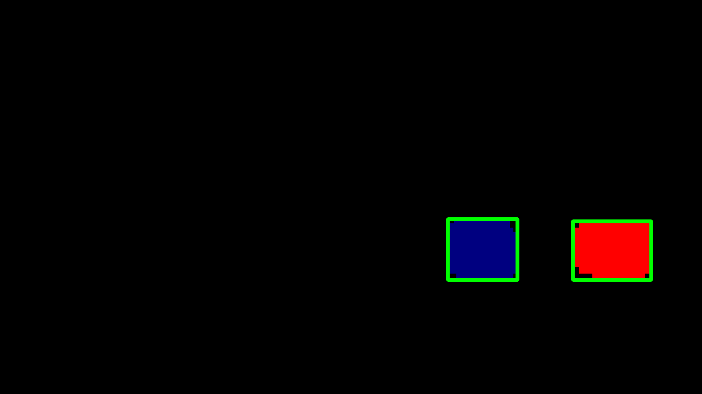  |
| 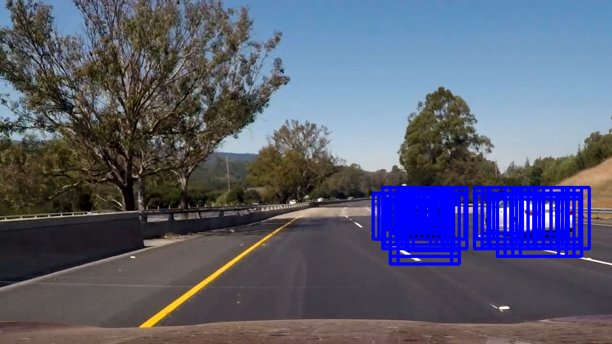    |   |   |   |
| 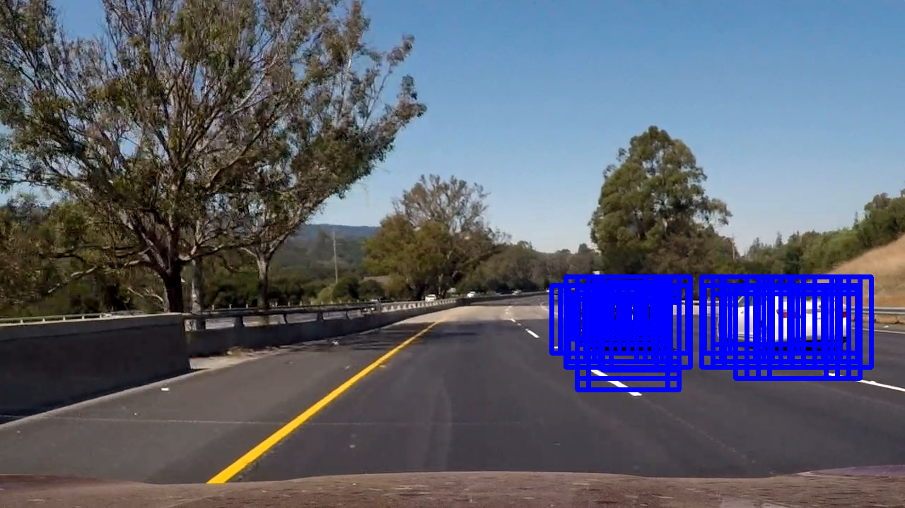    |   |   |   |
|     |   |   |   |

The accumulative heatmap from the above frames is displayed below on the left. The boundary boxes (green) and identified blobs (each marked with a unique non-green color) are displayed on the right. 

| accumulative heatmap | Identified blobs and boundary boxes |
|:-----------------------------|:----------------------------|
|![joint heatmap][image4a] |![boundary box][image4b]|

---
## Discussion
### 1. Problems / issues faced in the implementation of this project.  Where will the pipeline likely fail?  What could I do to make it more robust?
Below are a few issues faced in this project:

1. Occlusion: When one car covers part of the other car, the current method identifies the both as the same car, leading to a larger boundary box. One possible improvement is to implement a target tracking algorithm in which we track and update the location, speed and size of each vehicle. New images are used to update these parameters. When a vehicle is partially covered or fully covered, we mgiht continue to update the location and size of this vehicle based on past location, speed and size.

2. Resolution for farther-away cars: When a vehicle moves further away and ahead from our own vehicle, it becomes small in the field of view. When it becomes smaller than 64x64, due to the limited moving window step and resolution, it is easier to not have enough detected windows and miss the vehicle. One possibility for improvement is to adpatively change the per-frame threshold so that it takes less detected windows to claim that a vehicle is present. Another possibility is to improve the resolution of the camera. 